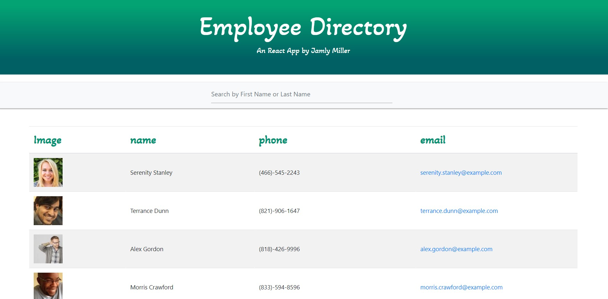

# React Employee Directory

## Description

This is a simple employee directory app created with React. This assignment required me to break up my app's UI into components, manage component state, and respond to user events.

## User Story

An employee or manager would be able to view non-sensitive data about other employees by searching employees' first name or last name, or any letters contained in their full name.

The user is able to view their entire employee directory at once so that they have quick access to their information.

As a female friendly app, the information categories would not include employee's age.

When the user loads the page, a table of employees renders.

## Funs

## Challenges

## Table of Contents

* [Usage](#usage)
* [Finished Product](#finished-product)
* [Technologies](#technologies)
* [Questions](#questions)

## Usage

To filter employees by name, type a name into the search line.

## Finished Product

## Technologies

* HTML
* CSS
* JavaScript
* React
* UIKit
* Create React App
* Axios

## Questions
​
If you have any questions about the repo, please contact me:

GitHub: [Jamly Miller](https://github.com/jamlymiller) 
LinkedIn: [Jamly Miller](https://www.linkedin.com/in/jamly-miller-125307200/)
Via Email: jamlymillertheprogrammer@gmail.com

## Learn More

